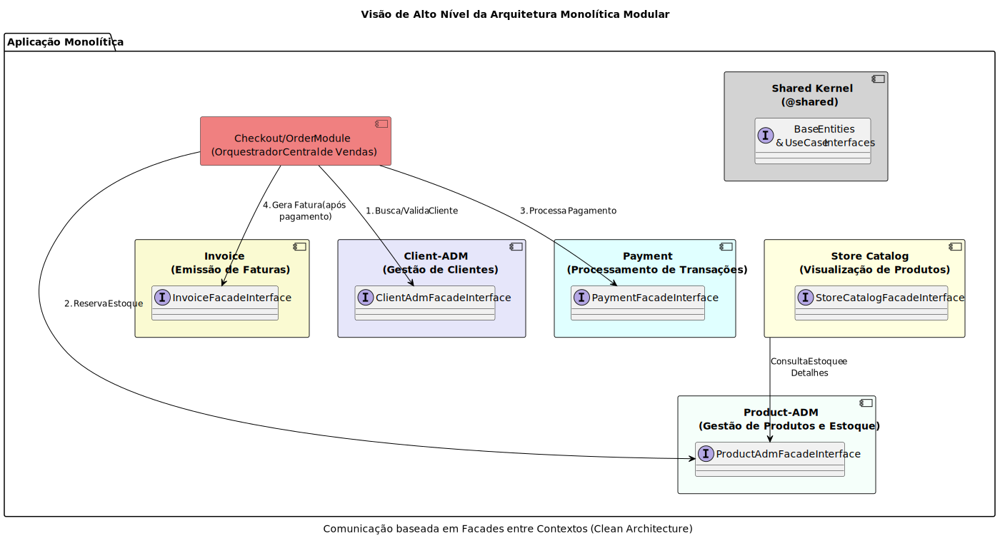
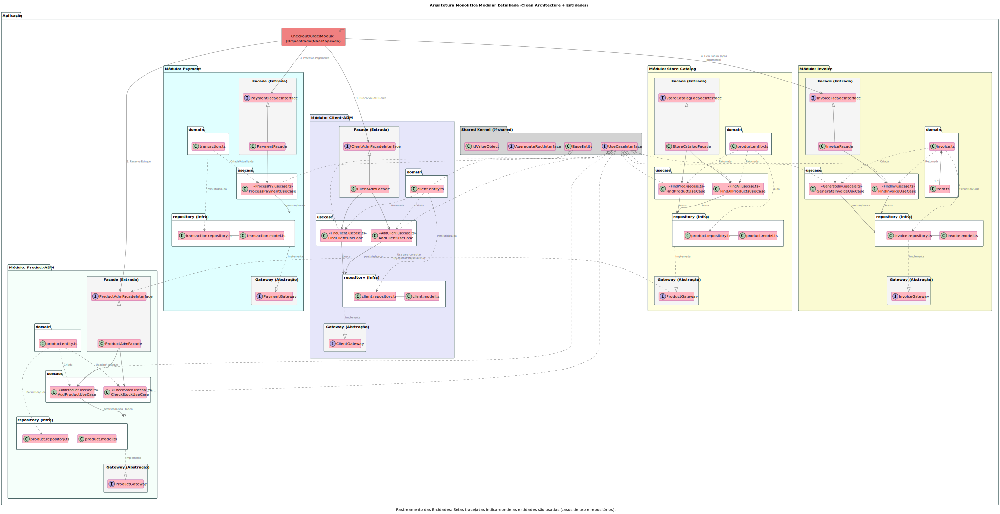

[](https://github.com/danielso2007/fc-monolito-curso/actions/workflows/node.js.yml)

[](https://github.com/danielso2007/fc-monolito-curso/pulls)
[](https://github.com/danielso2007/fc-monolito-curso/issues?q=is%3Aopen+is%3Aissue)


[](https://conventionalcommits.org)

**Observação:** A pasta `node_modules` foi incluído, pois no ambiente de estudo do trabalho é bloqueado. Já o `.vscode`, está com as tasks para usar no vscode.

# Projeto de curso Sistemas Monolíticos

Para estudo.

### Iniciando o projeto

Para iniciar, execute `npm run build` e depois `npm run start`.

### Carregando dados para testes

Execute `carregar-dados.sh` para adicionar vários dados para testes.

# Estrutura do projeto

Obs.: Para gerar essa saĩda, foi usado o comando: `tree -I "node_modules|dist|.git"`

```shell
├── CHANGELOG.md
├── jest.config.ts
├── package.json
├── package-lock.json
├── README.md
├── src
│   └── modules
│       ├── client-adm
│       │   ├── domain
│       │   │   └── client.entity.ts
│       │   ├── facade
│       │   │   ├── client-adm.facade.interface.ts
│       │   │   ├── client-adm.facade.spec.ts
│       │   │   └── client-adm.facade.ts
│       │   ├── factory
│       │   │   └── client-adm.facade.factory.ts
│       │   ├── gateway
│       │   │   └── client.gateway.ts
│       │   ├── repository
│       │   │   ├── client.model.ts
│       │   │   ├── client.repository.spec.ts
│       │   │   └── client.repository.ts
│       │   └── usecase
│       │       ├── add-client
│       │       │   ├── add-client.usecase.dto.ts
│       │       │   ├── add-client.usecase.spec.ts
│       │       │   └── add-client.usecase.ts
│       │       └── find-client
│       │           ├── find-client.usecase.dto.ts
│       │           ├── find-client.usecase.spec.ts
│       │           └── find-client.usecase.ts
│       ├── payment
│       │   ├── domain
│       │   │   └── transaction.ts
│       │   ├── facade
│       │   │   ├── facade.interface.ts
│       │   │   ├── payment.facade.spec.ts
│       │   │   └── payment.facade.ts
│       │   ├── factory
│       │   │   └── payment.facade.factory.ts
│       │   ├── gateway
│       │   │   └── payment.gateway.ts
│       │   ├── repository
│       │   │   ├── transaction.model.ts
│       │   │   ├── transaction.repository.spec.ts
│       │   │   └── transaction.repository.ts
│       │   └── usecase
│       │       └── process-payment
│       │           ├── process-payment.dto.ts
│       │           ├── process-payment.usecase.spec.ts
│       │           └── process-payment.usecase.ts
│       ├── product-adm
│       │   ├── domain
│       │   │   └── product.entity.ts
│       │   ├── facade
│       │   │   ├── product-adm.facade.interface.ts
│       │   │   ├── product-adm.facade.spec.ts
│       │   │   └── product-adm.facade.ts
│       │   ├── factory
│       │   │   └── facade.factory.ts
│       │   ├── gateway
│       │   │   └── product.gateway.ts
│       │   ├── repository
│       │   │   ├── product.model.ts
│       │   │   ├── product.repository.spec.ts
│       │   │   └── product.repository.ts
│       │   └── usecase
│       │       ├── add-product
│       │       │   ├── add-product.dto.ts
│       │       │   ├── add-product.usecase.spec.ts
│       │       │   └── add-product.usecase.ts
│       │       └── check-stock
│       │           ├── check-stock.dto.ts
│       │           ├── check-stock.usecase.spec.ts
│       │           └── check-stock.usecase.ts
│       ├── @shared
│       │   ├── domain
│       │   │   ├── entity
│       │   │   │   ├── aggregate-root.interface.ts
│       │   │   │   └── base.entity.ts
│       │   │   └── value-object
│       │   │       ├── address.ts
│       │   │       ├── id.value-object.ts
│       │   │       └── value-object.interface.ts
│       │   └── usecase
│       │       └── use-case.interface.ts
│       └── store-catalog
│           ├── domain
│           │   └── product.entity.ts
│           ├── facade
│           │   ├── store-catalog.facade.interface.ts
│           │   ├── store-catalog.facade.spec.ts
│           │   └── store-catalog.facade.ts
│           ├── factory
│           │   └── facade.factory.ts
│           ├── gateway
│           │   └── product.gateway.ts
│           ├── repository
│           │   ├── product.model.ts
│           │   ├── product.repository.spec.ts
│           │   └── product.repository.ts
│           └── usecase
│               ├── find-all-products
│               │   ├── find-all-products.dto.ts
│               │   ├── find-all-products.usecase.spec.ts
│               │   └── find-all-products.usecase.ts
│               └── find-product
│                   ├── find-product.dto.ts
│                   ├── find-product.usecase.spec.ts
│                   └── find-product.usecase.ts
├── tsconfig.json
└── tslint.json
```

As camadas seguem as dependências da Clean Architecture:
- domain → entidades e value objects (não dependem de nada externo).
- usecase → regras de negócio, depende apenas de interfaces (gateway, repository).
- repository e gateway → implementações externas (ex: persistência, APIs).
- facade → ponto de entrada do módulo, orquestra os casos de uso.
- factory → cria instâncias concretas da fachada com dependências injetadas.

O módulo @shared fornece contratos e abstrações reutilizadas entre módulos.



# Diagrama de arquitetura



# 🚀 Visão Geral das Dependências do Projeto

Este documento detalha as dependências de produção e desenvolvimento utilizadas neste projeto, explicando a função essencial de cada pacote.

---

## 📦 Dependências de Produção (`dependencies`)

Essas bibliotecas são cruciais para o **funcionamento e execução do código em ambiente de produção**.

| Dependência | Versão | Descrição |
| :--- | :--- | :--- |
| **express** | `^5.1.0` | O **framework web minimalista** para Node.js, usado para construir APIs REST e roteamento de forma eficiente. É a espinha dorsal da sua aplicação de servidor. |
| **dotenv** | `^17.2.3` | Carrega variáveis de ambiente de um arquivo `.env` para `process.env`. Essencial para **gerenciar configurações** como credenciais e chaves secretas de forma segura. |
| **sequelize** | `^1.2.1` | Um **ORM (Object-Relational Mapper)** para Node.js. Ele permite interagir com o banco de dados usando objetos JavaScript, em vez de comandos SQL brutos, simplificando as operações de banco de dados. |
| **sequelize-typescript** | `^0.6.11` | Fornece **decoradores e tipagem** para o Sequelize, tornando a definição de modelos de banco de dados mais limpa e totalmente tipada ao usar TypeScript. |
| **sqlite3** | `^5.1.7` | O **driver** que permite ao Sequelize se conectar e interagir com bancos de dados **SQLite**, um sistema de banco de dados leve baseado em arquivo. |
| **reflect-metadata** | `^0.2.2` | Biblioteca de suporte para **metadados de decoradores**. É necessária para que o TypeScript consiga injetar informações de tipo em tempo de execução, sendo fundamental para o funcionamento do `sequelize-typescript`. |
| **uuid** | `^13.0.0` | Utilidade para **gerar UUIDs (Identificadores Universais Exclusivos)**, garantindo a criação de identificadores únicos para registros, tokens, etc. |
| **yup** | `^1.7.1` | Um **validador de esquema de objetos**. Usado para definir e validar o formato, tipo e requisitos dos dados de entrada (por exemplo, em requisições de API). |
| **jstoxml** | `^7.0.1` | Converte **objetos JavaScript (JSON) em strings XML**. Útil para APIs que precisam fornecer dados em formato XML, como feeds. |
| **nodemon** | `^3.1.10` | Ferramenta que **monitora alterações nos arquivos** do projeto e automaticamente **reinicia o servidor Node.js**. Acelera o ciclo de desenvolvimento (embora listada em `dependencies`, é primariamente uma ferramenta de desenvolvimento). |
| **@types/express** | `^5.0.3` | Contém as **definições de tipo (typings)** para o framework **Express.js**, fornecendo suporte a tipos e autocompletar ao desenvolver com TypeScript. |

---

## 🛠️ Dependências de Desenvolvimento (`devDependencies`)

Esses pacotes são usados apenas durante o **desenvolvimento e testes** do projeto.

| Dependência | Versão | Descrição |
| :--- | :--- | :--- |
| **typescript** | `^5.9.3` | O **compilador** principal que adiciona tipagem estática ao JavaScript. Usado para escrever e verificar o código-fonte. |
| **jest** | `^30.2.0` | O **framework de testes** mais usado no ecossistema JavaScript/TypeScript, ideal para testes unitários e de integração. |
| **supertest** | `^7.1.4` | Usado para **testar requisições HTTP** de forma fácil. Ele simula chamadas de API, tornando os testes de integração com o Express mais simples e diretos. |
| **ts-node** | `^10.9.2` | Um **executor de TypeScript para Node.js**. Permite rodar arquivos `.ts` diretamente sem a necessidade de pré-compilação, facilitando o desenvolvimento. |
| **@swc/core** | `^1.13.5` | O **compilador de alta velocidade** escrito em Rust. É usado para transpilar (converter) o código TypeScript/ESNext para uma versão compatível de JavaScript de forma extremamente rápida. |
| **@swc/cli** | `^0.7.8` | A **interface de linha de comando** para o compilador SWC, permitindo executá-lo via terminal. |
| **@swc/jest** | `^0.2.39` | Um **transformador de código para o Jest** que utiliza o SWC, acelerando a compilação de arquivos de teste e reduzindo o tempo de execução do *suite* de testes. |
| **@types/jest** | `^30.0.0` | Contém as **definições de tipo (typings)** para o Jest. Garante que todas as funções e *matchers* do Jest sejam tipados corretamente no TypeScript. |
| **@types/supertest** | `^6.0.3` | Contém as **definições de tipo (typings)** para a biblioteca Supertest. |
| **@types/uuid** | `^11.0.0` | Contém as **definições de tipo (typings)** para a biblioteca uuid. |
| **@types/jstoxml** | `^5.0.0` | Contém as **definições de tipo (typings)** para a biblioteca jstoxml. |

---

## ⚙️ Scripts Personalizados

Esses comandos são atalhos definidos para tarefas comuns do projeto.

| Script | Comando | Descrição |
| :--- | :--- | :--- |
| **`test`** | `npm run tsc -- --noEmit && jest` | O comando principal para **executar os testes**. Primeiro, ele executa a verificação de tipos (`tsc --noEmit`) para garantir a consistência do código, e só então executa todos os testes unitários/integração com o **Jest**. |
| **`tsc`** | `tsc` | Executa o **compilador do TypeScript**. É usado internamente pelo script `test` para a verificação de tipos. |